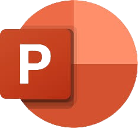
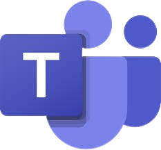
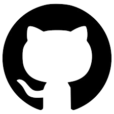
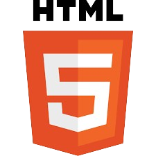
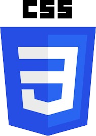
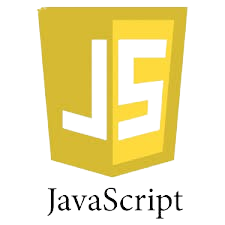
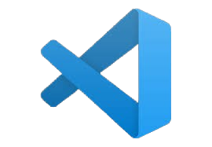

# CodeCrafterS
💻 About

"Our mission is to introduce people to coding, incorporating math in the process and unveiling the mysteries behind the code."

🗂️ Used technologies

Used technologies about the visual elements, docs and the communication






Used technologies for the site development







📄 Documents

Documentation

[Documentation]

Presenting

[Presentation]

📥 Installing

To install our project on your machine you just need to clone it. This can be done by In the CMD:

```https://github.com/AVGeorgiev23/CodeCrafterS```

🧒 Our Team

- [NGGeorgieva23](https://github.com/NGGeorgieva23) (Scrum trainer)

- [MKLazarova23](https://github.com/MKLazarova23) (Designer)

- [AVApostolov23](https://github.com/Anastas09) (Front end Developer)

- [AVGergiev23](https://github.com/AVGeorgiev23) (Front end Developer)
